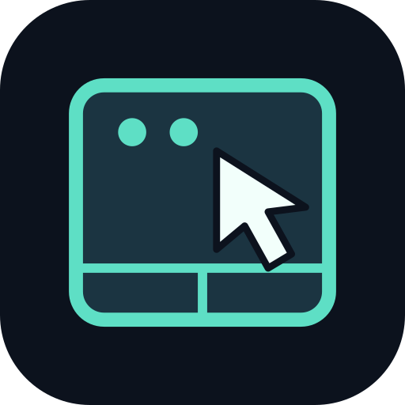

<p align="center">
  
</p>

<h1 align="center">Pocket Trackpad</h1>

<p align="center">
  <strong>スマホを、Windowsのトラックパッドに。</strong><br>
  Bluetoothでつないで、指先でカーソルもデスクトップも操作。
</p>

<p align="center">
  
  
  
</p>

<p align="center">
  <a href="https://github.com/MXCAKE3893/trackpad-app-win/releases/latest"><strong>APKをダウンロード</strong></a>
  &nbsp; · &nbsp;
  <a href="#はじめ方">はじめ方</a>
  &nbsp; · &nbsp;
  <a href="#ジェスチャー">ジェスチャー</a>
  &nbsp; · &nbsp;
  <a href="https://github.com/MXCAKE3893/trackpad-app-win/issues">不具合を報告</a>
</p>

---

Pocket Trackpadは、AndroidスマートフォンをWindows用のワイヤレストラックパッドとして使うアプリです。スマホのタッチ操作をBluetoothのマウス・キーボード入力に変換し、PCへ直接送信します。

**インストールするのは、スマホのアプリだけ。** Windows側の専用アプリや追加ドライバー、Wi-Fi接続、アカウント登録は不要です。

## 主な機能

- **基本操作をひと通り** — カーソル移動、左右クリック、ドラッグに対応。画面下部のボタンも使えます。
- **2本指でスクロール・ズーム** — 縦横スクロールとピンチ操作で、ページや画像を閲覧できます。
- **3・4本指でWindowsを操作** — アプリ切り替え、タスクビュー、デスクトップ表示、仮想デスクトップ切り替えを指の動きで実行できます。
- **操作感を調整** — カーソル感度とナチュラルスクロールを設定できます。
- **Bluetoothで直接通信** — サーバーを経由せず、スマホとPCの間で入力データを送ります。
- **ホーム画面になじむアイコン** — アダプティブアイコンとAndroid 13以降のテーマアイコンに対応しています。

## はじめ方

### 必要なもの

| デバイス | 条件 |
| :--- | :--- |
| Androidスマートフォン | Android 9以降、Bluetooth HID Device機能に対応する端末 |
| Windows PC | Bluetoothを利用できるWindows 10 / 11のPC |

Androidのバージョンが条件を満たしていても、メーカーや端末の実装によってBluetooth HIDを利用できない場合があります。

### 1. アプリをインストール

[最新リリース](https://github.com/MXCAKE3893/trackpad-app-win/releases/latest)から **`PocketTrackpad.apk`** をダウンロードし、Androidスマホにインストールします。

### 2. スマホを接続待機にする

アプリを開き、**「接続準備」**を押します。「付近のデバイス」の権限を求められたら許可してください。

続いて **「ペアリング」**を押し、Androidの確認画面で検出を許可します。アプリに **「PCから検出可能：［名前］」** と表示されたら、PC側の設定へ進みます。検出可能な時間は最大5分です。

### 3. Windowsからペアリング

Windowsの **設定 → Bluetoothとデバイス → デバイスの追加 → Bluetooth** を開き、スマホを選択します。確認番号が表示された場合は、両端末で承認してください。

> Windowsの一覧には、アプリ名ではなく**スマホのBluetooth名**が表示されます。アプリの「PCから検出可能」欄に表示されている名前を探してください。

### 4. 接続して操作

スマホのアプリで **「PCを選択」**を押し、ペアリングしたPCを選びます。「接続中」と表示されたら、中央のパッドを指で操作してください。

使用中はアプリを画面に表示したままにします。切断後は「接続準備」→「PCを選択」から再接続できます。

## ジェスチャー

| 操作 | 動作 |
| :--- | :--- |
| 1本指で移動 | カーソル移動 |
| 1本指でタップ | 左クリック |
| タップ後、すぐにもう一度触れたまま移動 | ドラッグ |
| 画面の左ボタンを押しながらパッドを操作 | ドラッグ |
| 2本指でタップ | 右クリック |
| 2本指で上下・左右に移動 | 縦・横スクロール |
| 2本指でピンチ | 拡大・縮小（Ctrl＋ホイール） |
| 3本指で右／左にスワイプ | アプリ切り替え（Alt＋Tab／Alt＋Shift＋Tab） |
| 3本指で上にスワイプ | タスクビュー（Win＋Tab） |
| 3本指で下にスワイプ | デスクトップ表示の切り替え（Win＋D） |
| 4本指で右／左にスワイプ | 仮想デスクトップ切り替え（Win＋Ctrl＋右／左） |

3・4本指ジェスチャーは、指を置いてから離すまでに1回実行されます。仮想デスクトップの切り替えには、Windows側で複数のデスクトップを作成しておく必要があります。

### 操作の仕組み

```text
Androidのタッチ操作
        ↓
アプリでジェスチャーを判定
        ↓ Bluetooth Classic HID
Windows標準のマウス・キーボード入力
```

Windowsにはマウスとキーボードとして認識されます。そのため、ピンチはCtrl＋ホイールによるズームになり、ズームや横スクロールの対応は操作先アプリによって異なります。Windows高精度タッチパッドのように、指の位置に追従してデスクトップ切り替えのアニメーションを動かす方式ではありません。

## 接続に困ったとき

<details>
<summary><strong>Windowsの追加一覧にスマホが出ない</strong></summary>

- スマホで「ペアリング」を押し、検出を許可したか確認してください。時間切れの場合はもう一度押します。
- アプリ名ではなく、スマホのBluetooth名で探してください。
- すでに登録済みなら、アプリの「PCを選択」から接続します。
- Windows 11で「Bluetooth デバイスの検出」の設定がある場合は、「詳細設定」に変更して検索してください。

</details>

<details>
<summary><strong>「接続できませんでした」と表示される</strong></summary>

片方の端末に古いペアリング情報が残っていると、認証に失敗する場合があります。

1. WindowsのBluetooth設定からスマホの登録を削除します。
2. スマホのBluetooth設定からPCの登録も削除します。
3. アプリに戻り、「接続準備」→「ペアリング」の順に操作します。
4. Windowsから再度追加し、両端末でペアリングを承認します。スマホの通知欄に承認要求が出ていないかも確認してください。

</details>

<details>
<summary><strong>HIDの準備が完了しない</strong></summary>

Bluetoothがオンになっていることと、「付近のデバイス」の権限を確認してください。ほかのBluetooth HIDアプリを使用している場合は終了してから再試行します。

解決しない場合は、[Issues](https://github.com/MXCAKE3893/trackpad-app-win/issues)にスマホの機種、Android・Windowsのバージョン、アプリの状態表示、再現手順を添えて報告してください。

</details>

## 開発

JavaとAndroid標準APIで実装しています。Bluetooth通信には `BluetoothHidDevice`、タッチ入力にはカスタムViewを使用しています。

### ビルド環境

- JDK 17以上（ビルド確認済み：JDK 20）
- Android SDK Platform 35
- Gradle 8.13（Wrapper同梱）

Android Studioでプロジェクトを開くか、`ANDROID_HOME` または `local.properties` の `sdk.dir` でAndroid SDKの場所を指定します。

**Windows / PowerShell**

```powershell
$env:ANDROID_HOME="$env:LOCALAPPDATA\Android\Sdk"
.\gradlew.bat assembleDebug lintDebug
```

**macOS / Linux**

```sh
./gradlew assembleDebug lintDebug
```

生成されたAPKは `app/build/outputs/apk/debug/app-debug.apk` に出力されます。

### リリースビルドと署名

```powershell
.\gradlew.bat assembleRelease lintRelease
```

リリースAPKは `app/build/outputs/apk/release/app-release.apk` に出力されます。リリースビルドではデバッグ機能を無効にしています。

秘密鍵はリポジトリに含まれていません。既定ではビルドするユーザーの `~/.android/debug.keystore` を参照します。別の場所の鍵を使う場合は `POCKET_TRACKPAD_KEYSTORE`、`POCKET_TRACKPAD_STORE_PASSWORD`、`POCKET_TRACKPAD_KEY_ALIAS`、`POCKET_TRACKPAD_KEY_PASSWORD` を環境変数で指定できます。別の鍵でビルドしたAPKは、公式配布APKへの上書き更新には使えません。

### ソース構成

```text
app/src/main/
├── java/jp/pocket/trackpad/
│   ├── MainActivity.java   # 画面・権限・ペアリング操作
│   ├── PadView.java        # タッチ入力・ジェスチャー判定
│   └── Hid.java            # HID定義・Bluetooth接続・入力送信
└── res/                    # アプリアイコン・配色
artwork/                    # アイコンのSVG原稿
```

### 開発ステータス

初期開発段階のアプリです。端末互換性と操作性の改善を進めています。

不具合の報告や改善提案は、[Issues](https://github.com/MXCAKE3893/trackpad-app-win/issues)で受け付けています。
